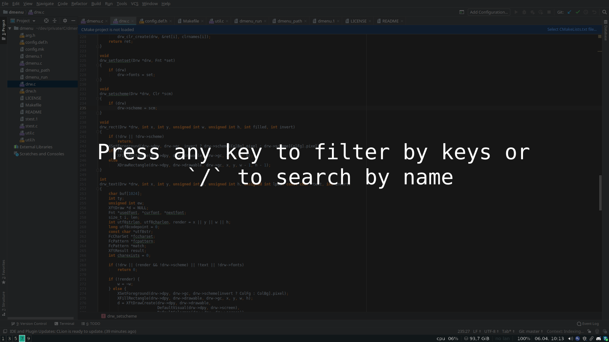
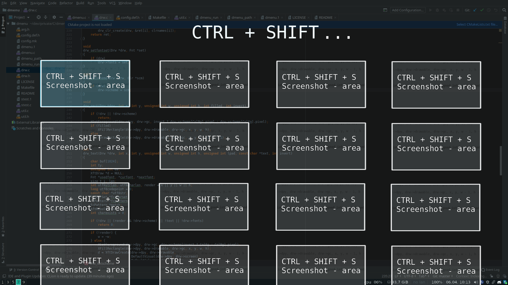

### The problem

There are too many hotkeys to remember. Learning a new tool
hands-on in a work setting usually leads to the use of inefficient
action paths due to frustrations (deadlines, online-only manuals, etc.)

### The solution

A tool that stores, displays and helps you locate the specific hotkey
you need, with a keyboard-only navigateable UI, to avoid breaking your
flow.

### The workflow

1.  Open the hotkey selection tool (probably bound to a hotkey itself)
    1.  Start pressing key combinations to filter the available hotkeys
    2.  Use vim-like (/) search to filter hotkeys (a and b can be used
        in tandom)
2.  Find and select the necessary hotkey
3.  Press return to execute the selected hotkey

### The mockup

A full-screen overlay, that captures all keyboard input.

#### The initial view

Place for:

1.  basic usage instructions / *customizable text*?
2.  *pinned* hotkeys?
3.  most commonly used *categories*?

#### Filtering by keys

##### Ordering:

1.  <s>Order by usage count (most common first)?</s>
2.  Order by relevancy to last focused app?
3.  **Order alphabetically for consistency?**

##### Comments:

Should probably be scrollable. Should it be mouse friendly? Probably
not. Use vim-like navigation: h,j,k,l,$,^

#### Searching by tags and filtering by keys

How to switch from the `/` search input to filtering by keys and vice
versa? Should probably be some kind of toggle. Maybe draw inspo from
vim: multiple different modes, but preferably with the same key to
switch between them.

##### 3 modes:

1.  `/` tag search mode
2.  filtering by associated keys
3.  results navigation mode
